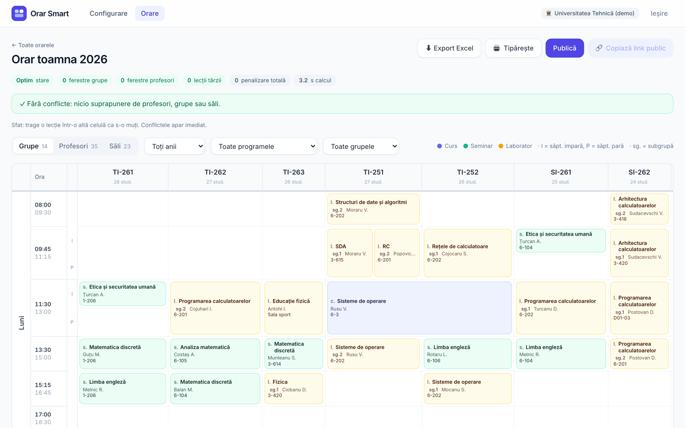
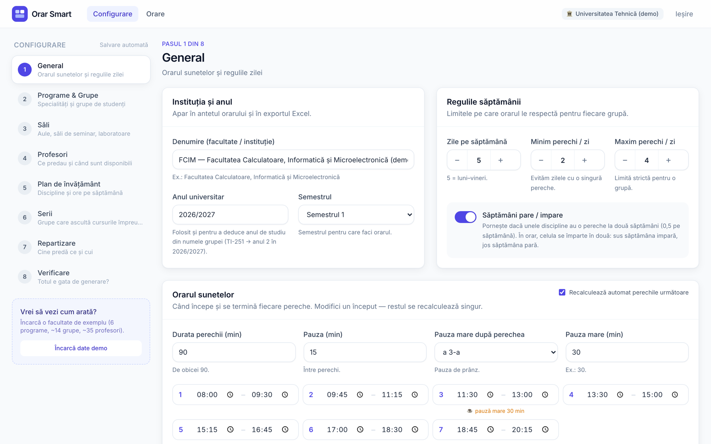
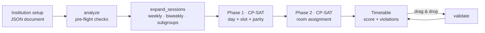

<div align="center">


# Orar Smart

**University timetables, generated in minutes — clash-free, humane, and in the format students already know.**

*Orarul facultății, gata în câteva minute.*

[](https://github.com/sebsti5/orar-smart/actions/workflows/ci.yml)


[Features](#-features) · [Screenshots](#-screenshots) · [Quick start](#-quick-start) · [How the solver works](#-how-the-solver-works) · [Deployment](#-deployment) · [Project layout](#-project-layout)

</div>

---

Orar Smart is a self-serve web app for universities. A faculty enters its data once through a
friendly 8-step wizard — bell schedule, groups, rooms, teachers, curriculum, streams — and a
constraint solver (Google OR-Tools **CP-SAT**) produces a complete weekly timetable with **no
teacher, group or room clashes** and as few gaps as possible. The result is shown in the classic
UTM/FCIM grid, can be fine-tuned by drag & drop, exported to Excel, and published through a
public link that works on any phone.

> Built around real data: the included importer parses the published FCIM UTM timetables
> (114 groups · 228 teachers · 82 rooms · 1 221 lessons) and re-solves them with zero conflicts.

## ✨ Features

| | |
|---|---|
| 🧭 **Guided setup wizard** | Eight steps with autosave, paste-from-Excel grids, name-based program/year detection (`TI-251` → TI, year 2) and a demo faculty one click away. |
| ⚡ **Optimal timetables in seconds** | Two-phase CP-SAT model: time slots first, then rooms. The demo faculty (14 groups, 209 lessons) solves to **optimal, 0 penalty in ~3 s**. |
| 🧠 **Smart fill** | Auto-assigns capable teachers to every subject × kind, balancing load against each teacher's weekly maximum. |
| 🔍 **Pre-flight analysis** | Catches impossible setups *before* solving: overloaded teachers, missing coverage, not enough labs of a size, parity mismatches — each with a “go to” link. |
| 🗓️ **Real university layout** | Groups as columns, lectures merged across a stream, odd/even-week split cells, lab subgroups, room codes like `3-611`. |
| ✋ **Drag & drop editing** | Move a lesson and see conflicts instantly; changes are validated server-side and saved. |
| 📤 **Share & export** | Excel export in the familiar layout, print-ready CSS, and a public read-only link per institution. |
| 🔐 **Secure by default** | bcrypt passwords, HTTP-only JWT session cookies, login rate limiting, optional site-wide password for private deployments. |

## 📸 Screenshots

<table>
  <tr>
    <td colspan="2"></td>
  </tr>
  <tr>
    <td width="50%"></td>
    <td width="50%"></td>
  </tr>
  <tr>
    <td align="center" colspan="2"><sub>Generated timetable (top) · landing page · setup wizard</sub></td>
  </tr>
</table>

## 🚀 Quick start

**Prerequisites:** [uv](https://docs.astral.sh/uv/) (Python 3.12) and Node.js 20+.

```bash
git clone https://github.com/sebsti5/orar-smart.git
cd orar-smart

# 1 · API — http://127.0.0.1:8000
cd backend && ./run.sh

# 2 · Web app — http://localhost:5173 (proxies /api to the backend)
cd ../frontend && npm install && npm run dev
```

Create an account, press **„Încarcă date demo”** in the wizard, then **„Generează orarul”** —
you'll have a full faculty timetable a few seconds later.

<details>
<summary><b>Single-process mode</b> (serve the built SPA from FastAPI)</summary>

```bash
cd frontend && npm run build
cd ../backend && ORAR_SECRET=change-me uv run uvicorn app.main:app --port 8000
```

</details>

### Configuration

| Variable | Default | Purpose |
|---|---|---|
| `ORAR_SECRET` | random, stored locally | JWT signing secret. **Required** when `ORAR_ENV=production`. |
| `ORAR_ENV` | — | Set to `production` to enforce the settings above. |
| `ORAR_DB` | `backend/data/orar.db` | SQLite database path. |
| `ORAR_COOKIE_SECURE` | `0` | `1` marks the session cookie `Secure` (use behind HTTPS). |
| `ORAR_SITE_PASSWORD` | — | Optional HTTP Basic password for the whole site; `/api/health` stays open. |
| `ORAR_SOLVER_WORKERS` | `8` | CP-SAT thread count — lower it on shared servers. |

## 🧮 How the solver works



**Hard constraints** — every session placed exactly once; at most one lesson per teacher,
group, subgroup and room per slot and week parity; teacher availability and pinned lessons;
daily lesson cap per group; room capacity per kind (Hall's condition per capacity threshold).

**Soft constraints** (weighted and minimised) — group gaps (×10), days with a single lesson (×8),
same subject twice in a day (×5), teacher gaps (×3), late slots (×2), late lectures and uneven
days (×1). Room assignment prefers the smallest adequate room and keeps a group in the same
building across consecutive slots.

The solver lives in [`backend/app/solver/`](backend/app/solver) as pure functions — no database,
no HTTP — which keeps it fast to test. The full specification is in [`docs/SPEC.md`](docs/SPEC.md).

## 🏗️ Architecture

| Layer | Stack |
|---|---|
| **Frontend** | React 18 · TypeScript · Vite · Tailwind CSS · React Router · Vitest + Testing Library |
| **Backend** | FastAPI · Pydantic 2 · SQLAlchemy 2 · SQLite · OR-Tools CP-SAT · openpyxl · pytest |
| **Delivery** | Multi-stage Docker image (Node build → slim Python runtime, non-root user) |

The data contract has a single source of truth — [`backend/app/schemas.py`](backend/app/schemas.py) —
mirrored on the client in [`frontend/src/types.ts`](frontend/src/types.ts). Solving runs in a
background worker; the client polls live progress and the best score found so far.

## 🧪 Testing

```bash
cd backend  && uv run pytest              # 118 tests — solver, API, export, auth
cd frontend && npm test && npm run typecheck   # 101 tests — components, hooks, grid logic
```

Every push and pull request runs both suites in [GitHub Actions](.github/workflows/ci.yml).

## 🐳 Deployment

A single container serves the SPA and the API:

```bash
cat > .env <<'EOF'
ORAR_SECRET=<long random string>
ORAR_SITE_PASSWORD=<optional>
EOF
docker compose -f docker-compose.prod.yml up -d --build
```

The compose file binds to `127.0.0.1:8098`, persists SQLite in `./data`, caps CPU/memory and
limits solver threads — put it behind a reverse proxy or tunnel that terminates TLS.

## 📥 Importing real timetables

[`tools/utm_import/`](tools/utm_import) turns the FCIM UTM PDF timetables into an Orar Smart
setup: it reconstructs the grid from the PDF's cell borders, detects lecture/seminar/lab cells,
odd/even weeks and subgroups, and seeds an account ready to re-solve. See its
[README](tools/utm_import/README.md).

## 📁 Project layout

```
orar-smart/
├── backend/
│   ├── app/
│   │   ├── api/          # FastAPI routers: auth, setup, timetables, public
│   │   ├── solver/       # CP-SAT model, room assignment, analysis, validation
│   │   ├── schemas.py    # data contract (source of truth)
│   │   ├── export.py     # Excel export in UTM layout
│   │   └── demo.py       # realistic demo faculty
│   └── tests/
├── frontend/
│   └── src/
│       ├── pages/        # landing, auth, setup wizard, timetables, public viewer
│       ├── components/   # design system + timetable grid
│       └── lib/          # grid, paste, planning, streams logic (unit tested)
├── tools/utm_import/     # FCIM UTM PDF importer
├── docs/SPEC.md          # product & solver specification
├── Dockerfile
└── docker-compose.prod.yml
```

## 🗺️ Roadmap

- [ ] College and school profiles (same model, different defaults)
- [ ] Per-teacher preferences (preferred days / time windows)
- [ ] Multi-faculty room sharing
- [ ] iCal feed per group and teacher

---

<div align="center">
<sub>© 2026 Orar Smart. All rights reserved.</sub>
</div>
